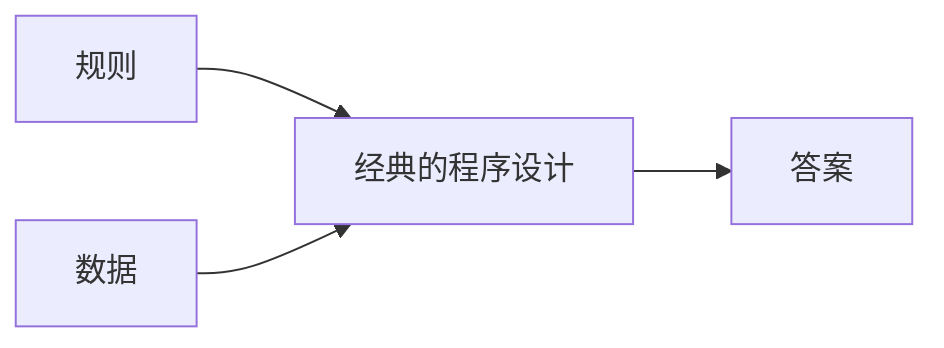
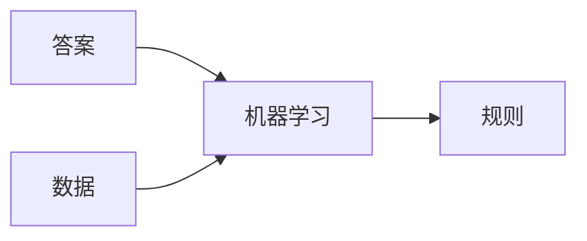

# DeepLearning

## 神经网络的学习目的是找到使损失函数的值尽可能小的权重参数

### 神经网络的学习步骤

+ 步骤一：先从mini-batch中随机挑选一些数据，计算损失函数的值
+ 步骤二：为了减小损失函数的值，需要计算各个权重参数的积分
+ 步骤三：将权重参数沿梯度方向进行微小调整
+ 步骤四：重复步骤一二三

使用反向传播法时，乘法反向时要反转
通过将神经网络的组成元素实现为层，可以高效地计算梯度（反向传播法）
初始权重参数设置不好的话，会出现梯度消失和表现力不足的问题
用作激活函数的函数最好具有关于零点对称的性质
Sigmoid函数使用Xavier初始值，Relu函数使用He初始值

### Batch Norm的优点

+ 可以使学习快速进行（增大学习率）
+ 不那么依赖权重初始值
+ 抑制过拟合（降低Dropout等的必要性）
  
机器学习的目的是提高泛化能力
过拟合：只能拟合训练数据，不能拟合非训练数据

### 过拟合的原因

+ 模型有大量参数，表现力强
+ 训练数据少

### 抑制过拟合的方法

+ 权值衰减（L2范数：所有元素的平方相加的平方根），模型简单时
+ Dropout，模型复杂时，跟集成学习相关
+ 获取更多训练数据
+ 减小网络容量

训练数据用于学习，测试数据用于评估泛化能力

### 超参数最优化

+ 设定超参数的范围
+ 使用上一步采样到的超参数的值进行学习，通过验证数据评估识别精度（把epoch设置得很小）
+ 重复上述步骤，根据识别精度的结果，缩小超参数的范围
  
卷积运算：输入数据与滤波器相乘后相加
填充的目的：调整输出的大小
步幅：应用滤波器的位置间隔
池化：缩小高、长方向上的空间运算(有MAX池化和Average池化)
池化的窗口大小和步幅大小相等

### 池化的特征

+ 没有要学习的参数
+ 通道数不变
+ 对微小的位置变化有鲁棒性

卷积运算利用im2col来加速运算，最后reshape

im2col:将应用滤波器的区域和滤波器横向展开为一个一维数组，因此数据会有重复，消耗较大空间，但矩阵运算非常快

CNN可以有效读取图像中的某种特性
通过学习，滤波器变成了有规律的滤波器

卷积层的滤波器会提取边缘或斑块等原始信息，随着层数的加深，提取的信息（反映强烈的神经元）也越来越抽象，神经元从简单的形状向高级信息变化，响应的对象也在变化

### AlexNet和LeNet的区别

+ 激活函数使用ReLu函数
+ 使用进行局部正规化的LRN层
+ 使用Dropout
  
加深层的好处:减少网络参数的数量，使学习更高效
叠加小型滤波器来加深网络的好处时可以减少参数的数量，扩大感受野
VGG:基于3X3的小型滤波器的卷积层运算是连续进行的，如先卷积层重叠2-4次，再通过池化层将大小减半，最后经由全连接层输出结果
GoogLeNet:在纵向上有深度，在横向上也有深度
ResNet：网络更深，加入了快捷结构，反向传播时可以无衰减的传播
CPU擅长连续复杂的运算，GPU擅长大型矩阵的乘积运算（通过im2col）
加快学习速度：GPU加速、分布式学习
神经网络具有健壮性，对精度要求不高
多模态处理：将组合图像和自然语言等多种信息进行处理
机器学习分为监督学习和无监督学习

### 深度学习的未来

+ 图像风格变换(2合1)
+ 图像生成（0合1)
+ 自动驾驶
+ 强化学习（自主学习，无评价）

人工智能包括机器学习，机器学习包括深度学习

一个数：标量张量
一个数列：向量或1D张量，数字的个数叫维度
张量维度看最多括号数

分类问题时，维度较小可能会成为信息瓶颈，永久地丢失相关信息
标签向量化有两种方法，需要对应不同的损失函数
输出维度应大于等于隐藏单元个数
回归（连续）与分类(离散)
不能从测试数据上计算数据标准化的均差和标准差
一般来说，训练数据越少，过拟合越严重，较小的网络可以抑制过拟合
数据较少时，可以进行k折验证
回归常用的损失函数位均方误差（mse），常见的回归指标是平均绝对误差（mae），精度不适合回归问题
二分类使用sigmoid函数，损失函数使用binary_crossentropy
一般采用rmsprop优化器
对于单标签，多分类问题使用softmax，损失函数使用分类交叉熵，中间层不应太小
数据集一般分为训练集，验证集，测试集

### 机器学习四大类

+ 监督学习:序列生成，语法树预测，目标检测，图像分割
+ 无监督学习：学习方法有降维和聚类
+ 自监督学习
+ 强化学习
  
可用数据较少时：简单的留出验证（随机的效果不同），k折验证，带有打乱数据的重复k折验证
选择模型评估时，要注意三点

+ 数据代表性（通常随机打乱数据）
+ 时间箭头（测试数据晚于训练数据）
+ 数据冗余（保证测试数据与训练数据没有交集）
  
数据预处理

+ 向量化
+ 值标准化
+ 处理缺失值
+ 特征提取

输入数据应用一下特征：取值较小（0-1），同质性
标准化方法：每个特征标准化，使其平均值为0，标准差为1
实现代码：
x-=x.mean(axis=0)
x/=x.std(axis=0)

良好的特征任然可以让你用最少的资源更优雅的解决问题
良好的特征可以让你用更少的数据解决问题

### 机器学习通用流程

+ 定义问题，收集数据集(非平稳问题无法解决)
+ 选择衡量成功的标准
+ 选择评估方法
+ 准备数据（数据格式化）
+ 开发比基准更好的模型(如下，优化函数通常为rmsprop)

| 问题类型           | 最后一层激活函数 | 损失函数                 |
| ------------------ | ---------------- | ------------------------ |
| 二分类问题         | sigmoid          | binary_crossentropy      |
| 多分类，单标签问题 | softmax          | categorical_crossentropy |
| 多分类，多标签问题 | sigmoid          | binary_crossentropy      |
| 回归到任意值       | 无               | mse                      |
| 回归到0-1          | sigmoid          | binary_crossentropy或mse |

+ 扩大模型规模:开发过拟合的模型
模型的理想刚好在欠拟合和或你的界线上、容量不足和容量过大的界线上
加更多层、每一层变大、增大训练次数
+ 模型正则化和调节超参数
添加dropout，尝试不同的架构（增加或减少层），添加L1或L2正则化，尝试不同的超参数（每层的单元个数和学习率），反复做特征工程（添加或删除特征）

卷积神经网络学到的模式具有平移不变性，使其在处理图像时可以高效利用数据，只需少量的数据就可以学到泛化能力的数据表示
CNN可以学到模式的空间层次结构
